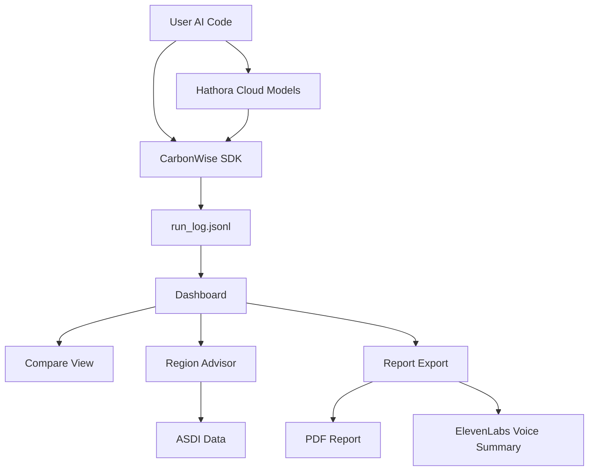

# 🌿 CarbonWise AI — Measure → Optimize → Prove Sustainable AI  
### International hAIckathon 2025 Submission - https://www.global-haickathon.com/
https://devpost.com/software/carbonwise-ai-measure-optimize-prove-sustainable-ai?ref_content=user-portfolio&ref_feature=in_progress

CarbonWise AI was selected as the winner of the “Best Project Built with ElevenLabs” prize at the International hAIckathon 2025.  
The project also placed 6th overall out of more than 200 teams chosen to compete globally.

**Theme:** Reduced Inequalities & Climate Action  

---

## 🧭 Overview

**CarbonWise AI** is my hackathon project — a lightweight system designed to make **AI sustainability measurable, actionable, and transparent**.

It combines a simple **Python SDK** that tracks the energy and carbon footprint of AI workloads with a **React dashboard** that helps visualize improvements, identify greener compute regions, and export tangible evidence of impact.

The idea is simple:  
> *Measure what matters — then prove you’ve made it better.*

---

## 💡 Why I Built This

AI is powerful but increasingly energy‑hungry.  
Most teams have no idea how much carbon their models produce or how to reduce it.  
I wanted to build a tool that makes sustainability tracking as natural as tracking latency or accuracy — something that’s open, easy, and data‑driven.

CarbonWise turns carbon and energy into engineering metrics that anyone can measure and improve, whether you’re a student, a researcher, or a large‑scale ML team.

---

## 🧩 What CarbonWise Does

1. **Measure:**  
   Use a Python decorator (`@track`) to automatically log runtime, energy (kWh), and CO₂e emissions from any AI model run.  

2. **Optimize:**  
   Run experiments (e.g., quantization, batching, speculative decoding) and instantly see the effect on efficiency and latency.  

3. **Prove:**  
   Visualize before/after runs, calculate **Software Carbon Intensity (SCI)**, and export a clean **PDF report** — something you can actually show to stakeholders or include in a paper.

4. **Advise:**  
   The built‑in **Region Advisor** uses open **ASDI** data (Amazon Sustainability Data Initiative) to recommend cloud regions with lower grid carbon intensity.  

5. **Extend:**  
   For the hackathon, I explored integrations with **Hathora** (for real‑time cloud inference) and **ElevenLabs** (to generate spoken sustainability summaries).

---

## ⚙️ Tech Overview

| Layer | Tools & Frameworks |
|-------|--------------------|
| Measurement | Python 3 · CodeCarbon |
| Dashboard | React + TypeScript (Lovable · Vite · Tailwind · Recharts) |
| Data Source | ASDI (Amazon Sustainability Data Initiative) |
| Cloud Integration | Hathora |
| Voice Narration | ElevenLabs API |
| Reporting | HTML‑to‑PDF (html2pdf.js · ReportLab) |
| Hosting | GitHub Pages · Vercel |

---

## 📂 Project Structure

### Backend (Python)
| File | Description |
|------|--------------|
| `tracker.py` | Core SDK — decorator that logs energy_kwh, co2e_kg, latency_ms, and SCI |
| `examples_baseline.py` / `examples_optimized.py` | Demo scripts that simulate two AI runs |
| `examples_hathora_client.py` | Calls a model endpoint on Hathora for cloud inference |
| `examples_eleven_tts.py` | Generates an ElevenLabs voice summary (`carbonwise_summary.mp3`) |
| `cw_report.py` | Creates a Markdown + PDF summary |
| `region_advisor.py` | Suggests greener regions using ASDI grid intensity data |
| `requirements.txt` | Backend dependencies |
| `run_log.jsonl` | Output log containing run metrics |

### Frontend (React)
- **Upload:** Import your run logs (`run_log.jsonl` or `.csv`)  
- **Compare:** View energy, CO₂e, and latency improvements  
- **Region Advisor:** Greener region recommendations (ASDI)  
- **Report:** Generate and download a shareable PDF summary  
- **Expectations:** Markdown page used during hackathon judging  

---

## 🚀 Getting Started

### Run the Dashboard
```bash
npm install
npm run dev
# open the local URL in your browser
```

### Use the Sample Data
1. Go to **Upload** → select `backend/sample_run_log.jsonl`.  
2. Explore **Compare**, **Region Advisor**, and **Report** tabs.  

### Generate New Logs
```bash
cd backend
python -m venv .venv 
.venv\Scripts\activate
pip install -r requirements.txt

python examples_baseline.py
python examples_optimized.py
```
You’ll get a new `run_log.jsonl`. Upload it again in the dashboard to refresh the charts.

---

## ☁️ Optional Add‑Ons

### Hathora Cloud Integration
For teams deploying models remotely, CarbonWise can track API‑based inference the same way as local runs.

```bash
python backend/examples_hathora_client.py
```
This logs a third “cloud” run alongside your baseline and optimized ones.

### ElevenLabs Voice Narration
CarbonWise can also narrate your sustainability results — making them more engaging and accessible.

```bash
python backend/examples_eleven_tts.py
```
Generates a `carbonwise_summary.mp3` you can play directly in your presentation.

---

## 🧮 The SCI Metric

CarbonWise uses the **Software Carbon Intensity (SCI)** formula:
```
SCI (Wh / request) = (energy_kwh * 1000) / max(requests, 1)
```

Each log entry looks like:
```json
{
  "run_id": "uuid",
  "run_name": "optimized",
  "energy_kwh": 0.58,
  "co2e_kg": 0.27,
  "latency_ms": 710,
  "sci_wh_per_req": 580.0,
  "meta": {"precision":"int4","region":"europe-west9"}
}
```

---

## 🌍 Open Data (ASDI)

The Region Advisor uses **ASDI grid‑intensity data** (gCO₂/kWh) to recommend where your workloads should run for the lowest environmental impact.  
You can also upload your own data file if you have provider‑specific emission metrics.

---

## 🧾 Typical Demo Flow

1. Generate baseline and optimized runs.  
2. (Optional) Add a cloud or voice run.  
3. Upload your `run_log.jsonl` to the dashboard.  
4. Compare results visually.  
5. Review ASDI‑based region suggestions.  
6. Export the **PDF** — your “proof of improvement.”  

---

## 🧱 Architecture Diagram



---

## 🏁 Closing Thoughts

CarbonWise AI isn’t about huge infrastructure — it’s about **visibility**.  
In one weekend, I wanted to show that sustainability tracking for AI can be simple, open, and measurable.  
If this project helps even one team make a more efficient design choice, it’s done its job.
