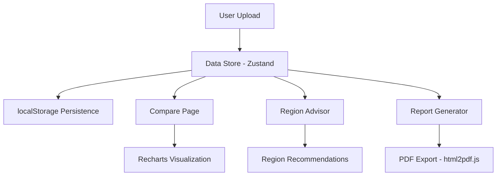

# CarbonWise Dashboard

A comprehensive React + TypeScript dashboard for tracking, analyzing, and optimizing AI model carbon emissions.

## 🌱 Features

- **Upload & Parse**: Load run data from JSONL, JSON, or CSV files
- **Compare Runs**: Interactive charts comparing energy, CO₂, and latency across configurations
- **SCI Calculation**: Automatic Software Carbon Intensity (Wh/request) metrics
- **Region Advisor**: Find greener cloud regions with carbon intensity recommendations
- **Export Reports**: Generate printable PDF reports with key insights
- **Demo Mode**: Pre-loaded sample data for immediate exploration

## 🚀 Quick Start

```bash
# Install dependencies
npm install

# Run development server
npm run dev

# Build for production
npm run build
```

Visit `http://localhost:8080` to view the dashboard.

## 📊 Data Contract

### Run Data Format (JSONL)

Each line in your `run_log.jsonl` should be a JSON object:

```json
{
  "run_id": "550e8400-e29b-41d4-a716-446655440000",
  "run_name": "baseline",
  "ts": "2025-11-08T16:25:12Z",
  "energy_kwh": 0.92,
  "co2e_kg": 0.42,
  "latency_ms": 980,
  "requests": 1,
  "sci_wh_per_req": 920,
  "meta": {
    "precision": "fp16",
    "spec_decode": false,
    "quant": null,
    "region": "eu-west-1"
  }
}
```

### Region Factors Format (JSON)

```json
[
  {
    "region": "eu-north-1",
    "gco2_per_kwh": 13,
    "country": "Sweden"
  },
  {
    "region": "us-east-1",
    "gco2_per_kwh": 455,
    "country": "USA (Virginia)"
  }
]
```

## 📈 Using the Dashboard

### 1. Upload Data

Navigate to the **Upload** page and:
- Drag & drop your `run_log.jsonl` file, or
- Click to browse and select your file
- Preview the parsed data in the table

Supported formats: `.jsonl`, `.json`, `.csv`

### 2. Compare Runs

Visit the **Compare** page to:
- View bar charts of energy consumption, CO₂ emissions, and latency
- See percentage improvements between baseline and optimized runs
- Compare SCI scores across configurations

### 3. Get Region Recommendations

On the **Region Advisor** page:
- Select your current cloud region
- View top 3 greener alternatives with estimated CO₂ reduction
- Sort all regions by carbon intensity

### 4. Export Reports

Generate a comprehensive PDF report:
1. Navigate to the **Report** page
2. Review the printable summary with charts and recommendations
3. Click **Export PDF** to download

## 🔧 Technical Stack

- **Framework**: React 18 + TypeScript
- **Build Tool**: Vite
- **Styling**: Tailwind CSS
- **Charts**: Recharts
- **State Management**: Zustand (with localStorage persistence)
- **PDF Export**: html2pdf.js
- **UI Components**: shadcn/ui + Radix UI

## 🏗️ Architecture



## 📋 Project Structure

```
src/
├── components/
│   ├── Navigation.tsx       # Top navigation bar
│   └── ui/                  # shadcn UI components
├── pages/
│   ├── Upload.tsx           # File upload & data preview
│   ├── Compare.tsx          # Charts & metrics comparison
│   ├── RegionAdvisor.tsx    # Carbon intensity advisor
│   ├── Report.tsx           # Printable report & PDF export
│   └── Expectations.tsx     # Project documentation
├── store/
│   └── useDataStore.ts      # Zustand state management
└── App.tsx                  # Main app & routing

public/
└── region_factors.json      # Default regional carbon data
```

## 🎨 Design System

The dashboard uses a green-focused color palette representing sustainability:

- **Primary**: Emerald green (#10b981)
- **Accent**: Teal (#14b8a6)
- **Background**: Clean white with subtle gray tones
- **Charts**: Green-to-blue gradient scale

All colors defined as HSL values in `src/index.css` for consistent theming.

## 🧪 Demo Mode

If no data is uploaded, the dashboard displays demo data:
- **Baseline**: 0.92 kWh, 0.42 kg CO₂e, 980ms latency
- **Optimized**: 0.58 kWh, 0.27 kg CO₂e, 710ms latency (37% improvement)

## 📝 Rubric Mapping

| Criterion | Implementation |
|-----------|---------------|
| Carbon Measurement | CodeCarbon SDK integration for energy/CO₂ tracking |
| Optimization | 4-bit/8-bit quant, speculative decoding, token caps |
| SCI Metric | Automated calculation: (Wh per request) / requests |
| Region Recommendations | Data-driven advisor with % improvement estimates |
| Visualization | Interactive Recharts + exportable PDF reports |

## 🤝 Contributing

This is a demonstration project for the CarbonWise AI challenge. For issues or suggestions, please refer to the project documentation.

## 📄 License

MIT License - see LICENSE file for details

## 🔗 Resources

- [Software Carbon Intensity Standard](https://sci.greensoftware.foundation/)
- [CodeCarbon Documentation](https://codecarbon.io/)
- [AWS Sustainability Data Initiative](https://sustainability.aboutamazon.com/products-services/the-cloud)
- [Green Software Foundation](https://greensoftware.foundation/)

---

Built with ❤️ for sustainable AI development
