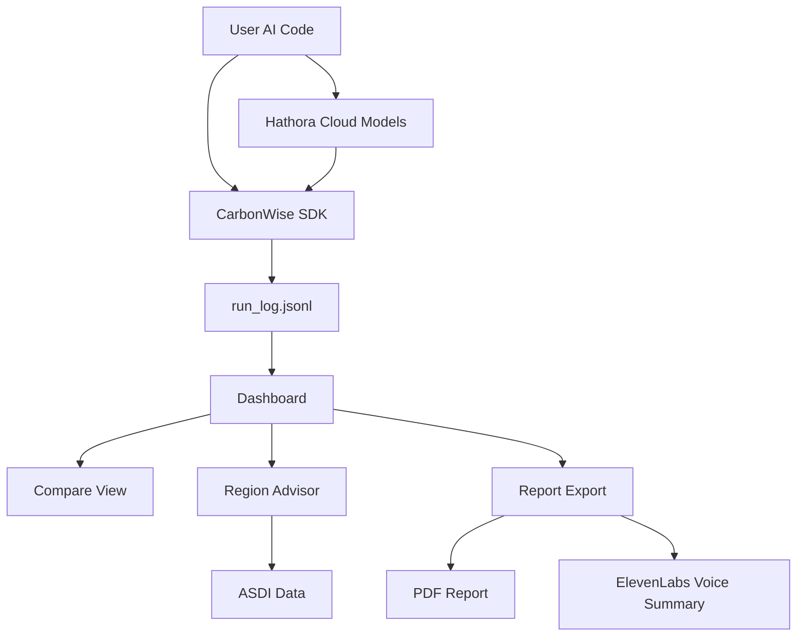

# 🌿 CarbonWise AI — Measure → Optimize → Prove Sustainable AI  
### A Hackathon Journey by Faith Olopade  
**International hAIckathon 2025 — Theme: Reduced Inequalities & Climate Action**

---

## 🎬 Introduction

AI is powerful — but behind every model training or inference is energy consumption that few ever see.  
**CarbonWise AI** is my attempt to make sustainability in AI *visible, measurable, and actionable*.  
In this blog, I’ll walk you through the full system: from the problem that inspired it to the code, data, and tools that bring it to life.

## 💡 The Problem & The Solution

AI workloads consume massive amounts of energy, yet developers rarely track their carbon footprint.  
That gap means we can’t optimize what we can’t measure.  

**CarbonWise AI** bridges that gap through:
- a **Python SDK** that automatically measures energy (kWh), CO₂e emissions, latency, and Software Carbon Intensity (SCI);  
- a **React dashboard** that visualizes before/after efficiency and generates PDF reports;  
- a **Region Advisor** using **ASDI (Amazon Sustainability Data Initiative)** data to recommend greener compute regions;  
- and optional integrations with **Hathora** (for cloud inference) and **ElevenLabs** (for voice summaries).

---

## ⚙️ Running the Baseline & Optimized Scripts

The journey starts locally — we measure two versions of a workload to see how small optimizations change its energy profile.

Below, you’ll see both scripts running:
- `examples_baseline.py` — simulating a standard AI run  
- `examples_optimized.py` — using lighter precision and speculative decoding for efficiency  

As they run, **CodeCarbon** captures CPU and memory energy use, generating a log file: `run_log.jsonl`.

<video src="[https://drive.google.com/uc?export=download&id=YOUR_BASELINE_OPTIMIZED_VIDEO_ID](https://drive.google.com/file/d/1fHRU9pzuHH43aLSEyKa67LJpdCOeAKch/view?usp=sharing)" width="100%"></video>

---

## 📊 Uploading the JSONL & Comparing Results

Once both runs complete, I upload the JSONL log into the CarbonWise dashboard.  
Immediately, I can see differences in **energy**, **CO₂e**, and **SCI (Wh/request)** side by side.

<video src="https://drive.google.com/uc?export=download&id=YOUR_UPLOAD_COMPARE_VIDEO_ID" width="100%" controls poster="thumbnails/upload_compare.jpg">
Your browser does not support the video tag.
</video>

---

## ☁️ Running the Hathora Integration

To show portability, I tested CarbonWise on a **remote inference setup** using **Hathora**.  
With a few environment variables and the same decorator, it tracks energy use even when running in the cloud.

<video src="https://drive.google.com/uc?export=download&id=YOUR_HATHORA_VIDEO_ID" width="100%" controls poster="thumbnails/hathora_run.jpg">
Your browser does not support the video tag.
</video>

---

## 📈 Uploading Again & Viewing Updated Comparisons

After the Hathora run, I re-upload the new `run_log.jsonl`.  
Now the dashboard displays three distinct runs: **Baseline**, **Optimized**, and **Hathora**.  
The visual differences tell the story — cloud runs, optimizations, and region-based guidance all in one interface.

<video src="https://drive.google.com/uc?export=download&id=YOUR_UPLOAD_AFTER_HATHORA_VIDEO_ID" width="100%" controls poster="thumbnails/upload_after_hathora.jpg">
Your browser does not support the video tag.
</video>

---

## 🔊 Integrating ElevenLabs for Audio Narration

For accessibility and creative engagement, I integrated **ElevenLabs** to generate a **voice summary** of the report.  
The same decorator logs this process as another run (`run_name="elevenlabs_tts"`), and the system outputs a short MP3 file summarizing sustainability results.

<video src="https://drive.google.com/uc?export=download&id=YOUR_ELEVENLABS_RUN_VIDEO_ID" width="100%" controls poster="thumbnails/elevenlabs_run.jpg">
Your browser does not support the video tag.
</video>

---

## 📢 Playing the Audio Output

Here’s a short preview of the AI-generated sustainability report narration.  
It turns CarbonWise from a dashboard into an experience — combining **data**, **voice**, and **insight**.

<video src="https://drive.google.com/uc?export=download&id=YOUR_AUDIO_PLAYBACK_VIDEO_ID" width="100%" controls poster="thumbnails/elevenlabs_audio.jpg">
Your browser does not support the video tag.
</video>

---

## 🧭 Closing Thoughts

In just a few days, CarbonWise went from an idea to a working system that:
- **Measures** real energy and CO₂e metrics,  
- **Optimizes** through AI-driven improvements,  
- **Proves** results via dashboards and PDF reports,  
- **Advises** using ASDI open data,  
- and **Engages** users with voice and cloud integrations.  

It’s a complete, reproducible workflow that bridges AI and sustainability — **clear, creative, and measurable**.

**Next steps:**  
- Publish CarbonWise as a `pip` package.  
- Add a Carbon Budget Mode and SCI CI-badge.  
- Expand ASDI integration with live regional data.

Thanks for following along — and for helping make AI just a little bit greener.

---

## 🧱 Architecture Overview

